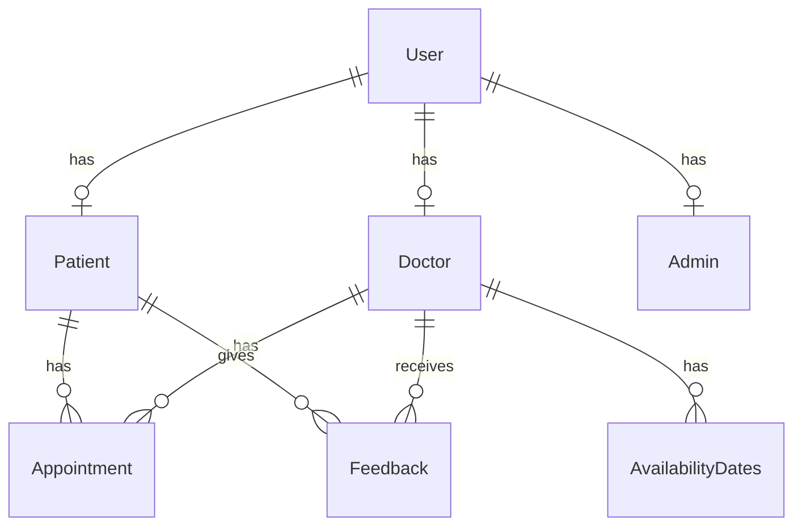

# Outpatient Appointment System

A Spring Boot-based REST API for managing hospital outpatient appointments, doctors, patients, and medical records.

## Features

- 👥 User Management (Patients, Doctors, Admins)
- 🏥 Doctor Availability Management
- 📅 Appointment Scheduling & Management
- ⭐ Patient Feedback System
- 🔒 Role-based Access Control
- 📋 Medical Records Management

## Tech Stack

- Java 17
- Spring Boot
- Spring Security
- Spring Data JPA
- MySQL/PostgreSQL
- Maven

## Getting Started

### Prerequisites

- JDK 17 or higher
- Maven 3.6+
- MySQL/PostgreSQL database

### Installation & Setup

1. Clone the repository:
```bash
git clone https://github.com/rohan2das/outpatient-appointment-system.git
cd outpatient-appointment-system
```

2. Configure the database connection in `src/main/resources/application.properties`:
```properties
spring.datasource.url=jdbc:mysql://localhost:3306/your_database
spring.datasource.username=your_username
spring.datasource.password=your_password
```

3. Build the project:
```bash
./mvnw clean install
```

4. Run the application:
```bash
./mvnw spring-boot:run
```

The application will start on `http://localhost:7007` (configured in application.properties)

## Frontend Application

A modern React frontend is included in the `frontend/` directory. See [frontend/README.md](frontend/README.md) for detailed setup instructions.

### Quick Start (Frontend)

1. Navigate to the frontend directory:
```bash
cd frontend
```

2. Install dependencies:
```bash
npm install
```

3. Start the development server:
```bash
npm run dev
```

The frontend will be available at `http://localhost:3000`

## API Documentation

### Authentication

#### Register a new user
```http
POST /api/auth/register
Content-Type: application/json

{
    "username": "johndoe",
    "password": "password123",
    "fullName": "John Doe",
    "email": "john.doe@example.com",
    "role": "PATIENT",
    "active": true
}
```

### Patient Management

#### Create a new patient
```http
POST /api/patients
Content-Type: application/json

{
    "user": {
        "id": 1
    },
    "patientName": "John Doe",
    "address": "123 Main St",
    "phoneNumber": "1234567890",
    "dateOfBirth": "1990-01-01",
    "gender": "Male",
    "bloodGroup": "O+",
    "medicalHistory": "No major issues",
    "age": 33
}
```

#### Get all patients
```http
GET /api/patients
```

#### Get patient by ID
```http
GET /api/patients/{id}
```

### Doctor Management

#### Create a new doctor
```http
POST /api/doctors
Content-Type: application/json

{
    "user": {
        "id": 2
    },
    "doctorName": "Dr. Jane Smith",
    "specialization": "Cardiology",
    "qualification": "MD",
    "experience": "10 years",
    "availability": "Mon-Fri, 9AM-5PM",
    "isAvailable": true,
    "location": "City Hospital",
    "hospitalName": "City Hospital",
    "chargedPerVisit": 100.00
}
```

#### Get available doctors
```http
GET /api/doctors/available
```

#### Get doctors by specialization
```http
GET /api/doctors/specialization/{specialization}
```

### Appointment Management

#### Create an appointment
```http
POST /api/appointments
Content-Type: application/json

{
    "patient": {
        "id": 1
    },
    "doctor": {
        "id": 1
    },
    "appointmentDateTime": "2025-11-05T10:00:00",
    "reason": "Regular checkup",
    "status": "PENDING",
    "notes": "First visit"
}
```

#### Get appointments by doctor
```http
GET /api/appointments/doctor/{doctorId}
```

#### Get appointments by status
```http
GET /api/appointments/status/{status}
```

#### Manage appointment status
```http
PUT /api/appointments/{id}/approve
PUT /api/appointments/{id}/reject
PUT /api/appointments/{id}/cancel
```

## Entity Relationship Diagram



## Development

### Project Structure
```
src/
├── main/
│   ├── java/
│   │   └── com/
│   │       └── appointment/
│   │           ├── config/
│   │           ├── controller/
│   │           ├── model/
│   │           ├── repository/
│   │           └── service/
│   └── resources/
│       └── application.properties
└── test/
    └── java/
```

### Key Components

- **Models**: Define the database entities (User, Patient, Doctor, Appointment, etc.)
- **Controllers**: Handle HTTP requests and define API endpoints
- **Services**: Implement business logic
- **Repositories**: Handle database operations
- **Config**: Configuration classes including security setup

## Testing

The project includes unit tests and integration tests. Run them using:

```bash
./mvnw test
```

For API testing, you can use the provided Postman collection in the `postman/` directory.

## Security

The application implements role-based access control with three main roles:
- PATIENT
- DOCTOR
- ADMIN

Each role has specific permissions and access levels to various endpoints.

## Contributing

1. Fork the repository
2. Create your feature branch (`git checkout -b feature/amazing-feature`)
3. Commit your changes (`git commit -m 'Add some amazing feature'`)
4. Push to the branch (`git push origin feature/amazing-feature`)
5. Open a Pull Request

## License

[MIT License](LICENSE)